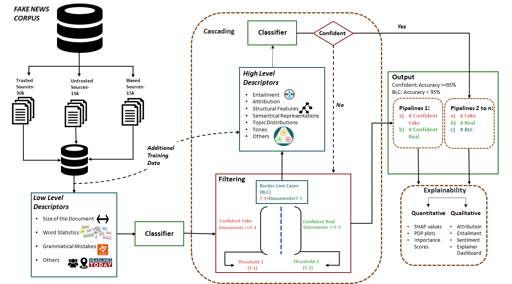

# FACADE: Fake Articles Classification and Decision Explanation

* [Demo Video](https://drive.google.com/file/d/1kMobWPQkyZfEHMAYBx_GN-HpTO7nlBB4/view?usp=sharing)
* [Live Webapp]() 

## System description

The **FACADE** system is designed with a cascading architecture (shown in the figure below) composed of two classification pipelines.
For each document to analyse, the detection process starts with a first classifier which exploits basic linguistic features (*low-level descriptors*) previously extracted from several fake news datasets.
The second pipeline makes use also of more complex features (*high-level descriptors*), such as sentiment, emotion, and attribution to known real or fake sources, computed by additional algorithms.
We further present an *explainable user interface* designed in a *Harry Potter style*, which can help end users understand what parts of the investigated article are likely to be fake and for what reasons through the implementation of feature importance and post-hoc methods.

## Datasets used for features extraction

* [Fake News Corpus](https://github.com/several27/FakeNewsCorpus)
* [ISOT Fake News Dataset](https://www.uvic.ca/ecs/ece/isot/datasets/fake-news/index.php)
* [Fake News Dataset](https://www.kaggle.com/datasets/jruvika/fake-news-detection)
* [Multi-Perspective Question Answering Dataset (MPQA)](https://mpqa.cs.pitt.edu/corpora/mpqa_corpus/)
* [Myers-Briggs Personality Type Dataset (MBTI)](https://www.kaggle.com/datasets/datasnaek/mbti-type)

